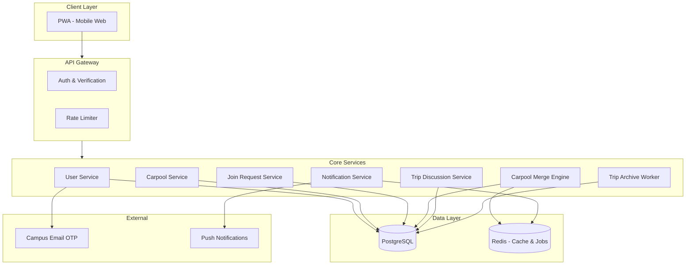
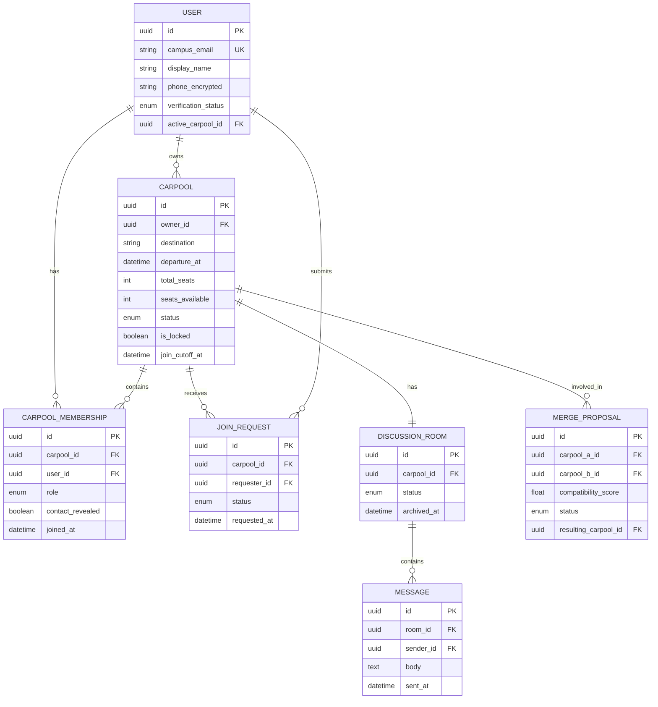
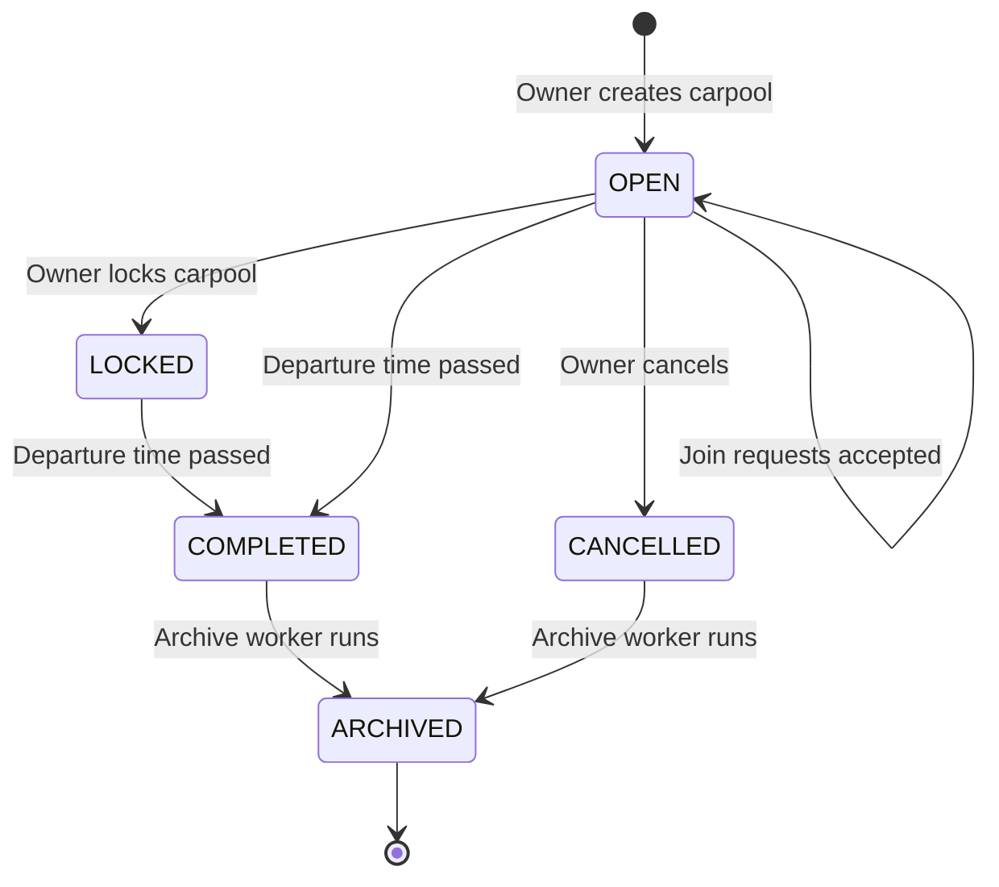
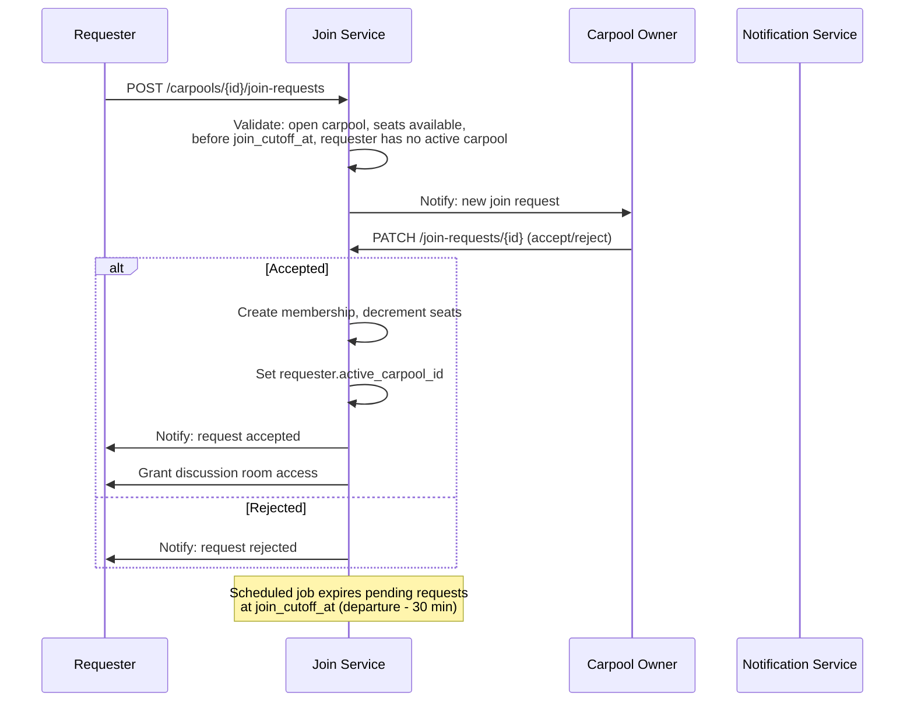
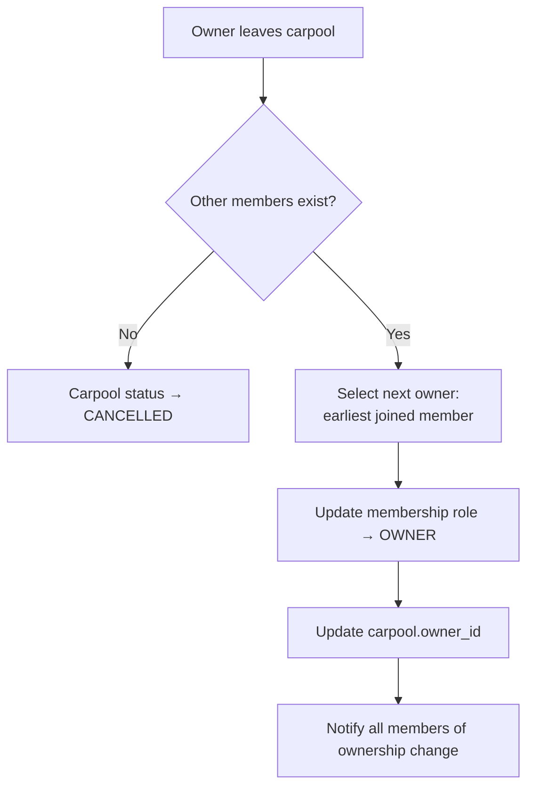
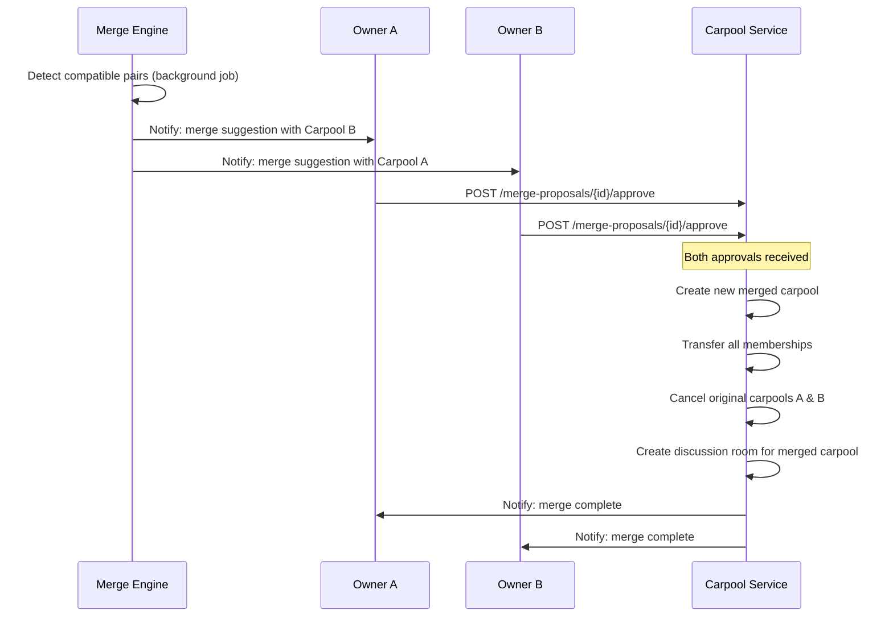
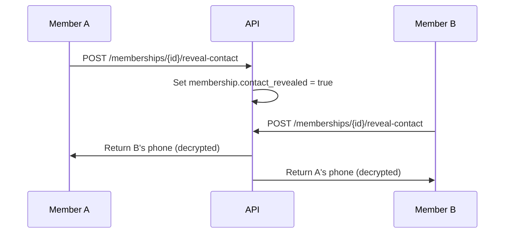
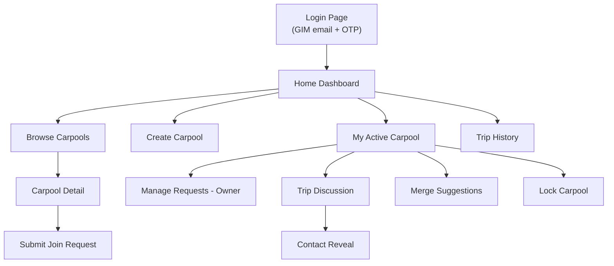
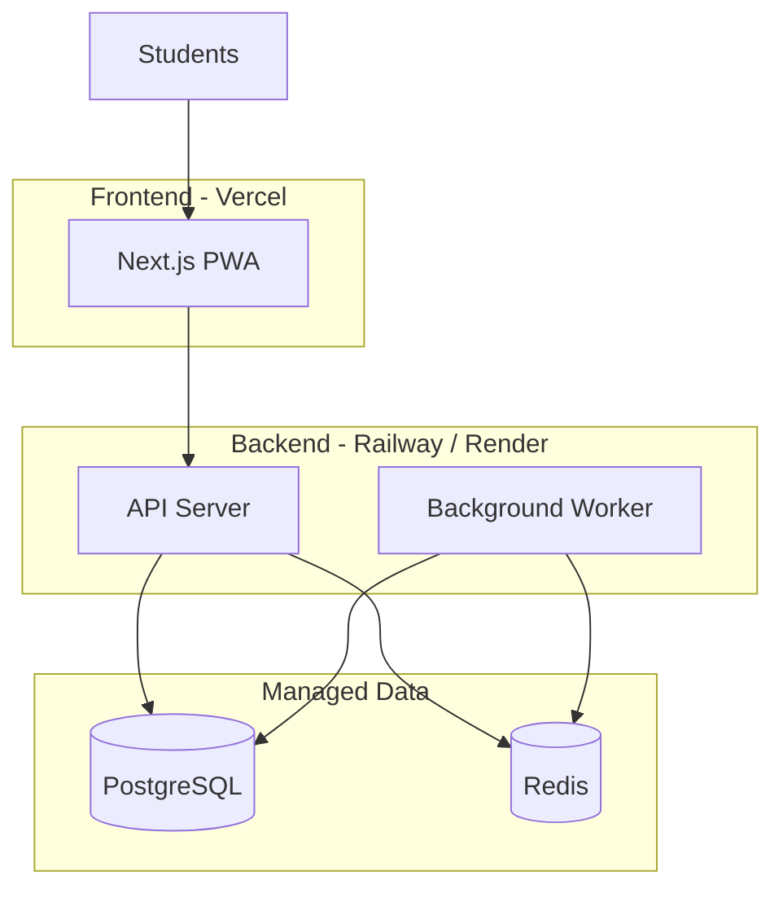
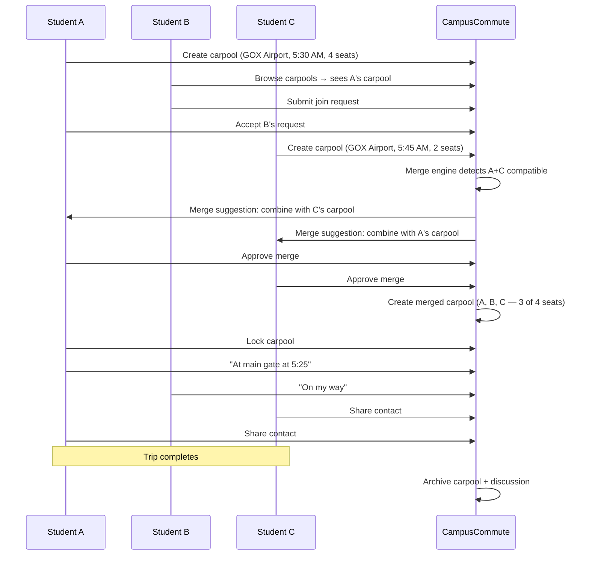

# System Architecture — CampusCommute

> **Product:** CampusCommute — A Student Carpooling Platform for Campus-to-Transit Travel  
> **Scope:** MVP + scalable architecture for GIM and similar campuses  
> **Source:** Derived from [problemstatement.md](./problemstatement.md)

---

## 1. Executive Summary

CampusCommute is a **centralized carpool coordination platform** that replaces fragmented WhatsApp/Telegram coordination with structured carpool discovery, membership management, and trip-specific communication.

Students create or join carpools for shared taxi rides to airports, railway stations, bus terminals, and nearby cities. The system enforces **one active carpool per student**, manages **owner-driven membership control**, provides **temporary trip discussion rooms**, and supports **intelligent carpool merging** to maximize taxi occupancy.

### Design Priorities

| Priority | Rationale |
|----------|-----------|
| **Carpool discovery** | Core problem is visibility, not transport availability |
| **Membership integrity** | One active carpool, locked groups, controlled join flow |
| **Owner governance** | Clear responsibilities for accepting, locking, and managing trips |
| **Trip-scoped communication** | Replace external messaging with per-carpool discussion rooms |
| **Merge optimization** | Combine partial carpools into full taxis automatically |
| **Campus trust** | Verified student identity; contact reveal only after membership |

---

## 2. Problem-to-Architecture Mapping

| Problem / Requirement (from problem statement) | Architectural Component |
|------------------------------------------------|-------------------------|
| No centralized discovery | **Carpool Catalog Service** with destination/date/time filters |
| Scattered travel plans | **Carpool** as the single structured unit of travel intent |
| No join-request process | **Join Request Workflow** with owner approve/reject |
| No ownership or seat management | **Carpool Membership Model** with owner, members, seat capacity |
| No trip-specific communication | **Trip Discussion Room** per carpool, auto-archived post-trip |
| Public contact sharing | **Gated Contact Reveal** after confirmed membership |
| Partial carpools booking separate taxis | **Carpool Merge Engine** with dual-owner approval |
| Duplicate bookings | **Single Active Carpool constraint** at database level |
| Cluttered external messaging | In-app discussion + push notifications |
| Low taxi utilization | Merge engine + browse-before-create UX nudges |

---

## 3. High-Level Architecture



### 3.1 Architecture Style

**Modular monolith** for MVP — one deployable backend with isolated service modules:

- `CarpoolService` — CRUD, lock, ownership transfer
- `JoinRequestService` — request lifecycle, 30-minute cutoff
- `MergeEngine` — compatibility scoring, dual approval
- `DiscussionService` — trip-scoped messaging
- `ArchiveWorker` — scheduled post-departure archival

This suits GIM-scale traffic (~600 students, ~150 peak concurrent) without microservice overhead. Modules can be extracted into workers or separate services if multi-campus expansion is validated.

---

## 4. User Roles & Permissions

| Role | Description | Permissions |
|------|-------------|-------------|
| **Student** | Verified campus student | Create/join carpools, request merge, participate in discussions |
| **Carpool Owner** | Student who created the carpool (or inherited ownership) | Accept/reject join requests, remove members, update trip, lock carpool, approve merges |
| **Carpool Member** | Confirmed member (non-owner) | View trip details, post in discussion, leave carpool, reveal contact |
| **Admin** | Platform operator | Moderate reports, override disputes, view analytics |

### Permission Matrix

| Action | Owner | Member | Non-member |
|--------|-------|--------|------------|
| Browse open carpools | ✅ | ✅ | ✅ |
| Create carpool | ✅* | ✅* | ✅* |
| Request to join | ✅* | ❌ | ✅ |
| Accept/reject requests | ✅ | ❌ | ❌ |
| Post in trip discussion | ✅ | ✅ | ❌ |
| View contact info | ✅ | ✅ | ❌ |
| Lock carpool | ✅ | ❌ | ❌ |
| Approve merge | ✅ | ❌ | ❌ |
| Remove member | ✅ | ❌ | ❌ |

\*Subject to **single active carpool** constraint — blocked if user already belongs to an active carpool.

---

## 5. Core Domain Model



### 5.1 Entity Details

#### User
- Authenticated via **GIM email (`@gim.ac.in`) only** with passwordless OTP login — see [§12](#12-authentication--login-system).
- `active_carpool_id` enforces the **single active carpool** rule at the application and DB constraint level.
- `phone_encrypted` — decrypted only when membership is confirmed and user opts to reveal contact.

#### Carpool
The central aggregate root. Represents one shared taxi trip.

| Field | Description |
|-------|-------------|
| `destination` | Predefined destination (e.g., GOX Airport, Madgaon Station) |
| `departure_at` | Scheduled departure datetime |
| `total_seats` | Taxi capacity (typically 4) |
| `seats_available` | Remaining open seats |
| `status` | `OPEN`, `LOCKED`, `COMPLETED`, `CANCELLED`, `ARCHIVED` |
| `is_locked` | Owner finalizes group; no new join requests |
| `join_cutoff_at` | Auto-computed: `departure_at - 30 minutes` |

#### Carpool Membership
Links users to carpools with role (`OWNER`, `MEMBER`). Tracks whether contact has been revealed to other members.

#### Join Request
Lifecycle: `PENDING` → `ACCEPTED` | `REJECTED` | `EXPIRED` | `CANCELLED`

- Auto-expires when `join_cutoff_at` is reached.
- On accept: create membership, decrement `seats_available`, notify requester.

#### Discussion Room
One per carpool. Status: `ACTIVE` → `ARCHIVED`. Only confirmed members can read/write. Archived automatically after trip completion.

#### Merge Proposal
Links two compatible carpools. Requires **both owners to approve** before creating a merged carpool with combined members and recalculated seat counts.

---

## 6. Carpool Lifecycle



### 6.1 State Transitions

| From | To | Trigger |
|------|----|---------|
| — | `OPEN` | Student creates carpool (becomes owner + first member) |
| `OPEN` | `OPEN` | Join request accepted; seats decremented |
| `OPEN` | `LOCKED` | Owner locks carpool (group finalized) |
| `OPEN` | `CANCELLED` | Owner cancels before departure |
| `OPEN` / `LOCKED` | `COMPLETED` | `departure_at` elapsed |
| `COMPLETED` / `CANCELLED` | `ARCHIVED` | Archive worker (24h after departure) |

### 6.2 Single Active Carpool Enforcement

```
ON carpool create OR join accept:
  IF user.active_carpool_id IS NOT NULL
    AND existing carpool.status IN (OPEN, LOCKED)
  THEN reject with error: "Already in an active carpool"

ON carpool complete / cancel / member leave:
  IF user has no other active membership
  THEN set user.active_carpool_id = NULL
```

Implemented as:
1. **Application-level check** before create/join
2. **Database constraint** — partial unique index on `carpool_membership(user_id)` where carpool status is active
3. **User.active_carpool_id** denormalized field for fast lookup

---

## 7. Join Request Workflow



### 7.1 Join Request Rules

| Rule | Implementation |
|------|----------------|
| Carpool must be `OPEN` and not locked | Status check on create |
| Seats available > 0 | Atomic decrement on accept |
| Before join cutoff | Reject if `now >= join_cutoff_at` |
| Requester has no active carpool | Check `user.active_carpool_id` |
| One pending request per user per carpool | Unique constraint |
| Auto-expire at cutoff | Cron job / scheduled task |

---

## 8. Ownership Transfer

When the owner leaves or is removed:



**Selection rule:** Earliest `joined_at` among remaining members becomes the new owner. If tied, lowest `user_id` (deterministic tiebreak).

---

## 9. Carpool Merge Engine

The merge engine addresses the GIM scenario where Students A, B, and C each book separate taxis to GOX Airport within 30 minutes of each other.

### 9.1 Compatibility Criteria

Two carpools `(A, B)` are merge candidates when:

| Criterion | Rule |
|-----------|------|
| Destination | Exact match |
| Travel date | Same calendar date |
| Departure time | Within ± 45 minutes |
| Combined occupancy | `members_A + members_B <= total_seats` (typically ≤ 4) |
| Status | Both `OPEN`, not locked |
| Owner | Different owners (no self-merge) |

**Compatibility score** (for ranking suggestions):

```
score = 0.40 × destination_match
      + 0.35 × time_proximity (1 - |Δt| / 45min)
      + 0.25 × seat_utilization (combined_members / total_seats)
```

Minimum threshold: **0.70** to surface as a merge suggestion.

### 9.2 Merge Flow



### 9.3 Merge Rules

- Both owners must approve within **2 hours** or proposal expires.
- If either carpool is locked or reaches join cutoff before approval, proposal is cancelled.
- Merged carpool owner = owner of the **larger** carpool (by member count); tie → earlier `created_at`.
- All members' `active_carpool_id` updated to the new merged carpool.
- Original carpools set to `CANCELLED` with reason `MERGED`.

---

## 10. Trip Discussion Service

Each carpool gets a dedicated, temporary discussion room — replacing WhatsApp coordination.

### 10.1 Access Control

| Rule | Detail |
|------|--------|
| Read/write access | Confirmed members only (owner + accepted members) |
| Non-members | No access, even read-only |
| Post-lock | Discussion remains open until trip archived |
| Post-trip | Room status → `ARCHIVED`; read-only for 7 days, then purged |

### 10.2 Features (MVP)

- Text messages with timestamps
- System messages (e.g., "Rahul joined the carpool", "Carpool locked by owner")
- Canned quick replies: *"At main gate"*, *"Running 10 min late"*, *"Taxi arrived"*
- Contact reveal prompt after lock (optional mutual opt-in)

### 10.3 Real-Time Delivery

**MVP:** Server-Sent Events (SSE) or short polling (5s interval) for new messages.  
**Phase 2:** WebSocket for instant delivery.

---

## 11. Contact Reveal

Contact information is **never public**. Reveal flow:

1. User becomes confirmed member (join request accepted).
2. In trip discussion, user taps **"Share My Contact"**.
3. Contact visible to other members who have also opted in.
4. Phone number decrypted server-side and returned only to opted-in members.



---

## 12. Authentication & Login System

CampusCommute uses **passwordless, email-based authentication** restricted to **Goa Institute of Management (GIM) students only**. There is no separate sign-up flow — a student enters their GIM email on the login page, receives a one-time password (OTP) via email, and gains access upon verification.

### 12.1 Access Policy

| Rule | Detail |
|------|--------|
| Allowed domain | **`@gim.ac.in` only** — all other domains are rejected |
| Auth method | Passwordless OTP (no passwords stored) |
| First-time users | Auto-registered on first successful OTP verification |
| Returning users | Same login flow — email + OTP |
| Unauthenticated access | Public landing page only; all app routes require valid JWT |

**Domain validation** runs on both frontend (immediate feedback) and backend (authoritative reject):

```
email.endsWith("@gim.ac.in") AND valid email format
```

Examples:
- ✅ `student.name@gim.ac.in`
- ❌ `student@gmail.com` — rejected
- ❌ `student@gim.edu.in` — rejected

### 12.2 OTP Authentication Flow

```mermaid
sequenceDiagram
    participant S as GIM Student
    participant UI as Login Page
    participant API as Auth Service
    participant Mail as Email Service (Resend)
    participant DB as Database

    S->>UI: Open /login
    S->>UI: Enter email (@gim.ac.in)
    UI->>UI: Client-side domain validation
    UI->>API: POST /auth/send-otp { email }
    API->>API: Validate @gim.ac.in domain
    API->>API: Rate-limit check (5/hour per email)
    API->>DB: Store hashed OTP + expiry (10 min)
    API->>Mail: Send 6-digit OTP to student email
    Mail->>S: Email: "Your CampusCommute verification code"
    UI->>UI: Show OTP entry screen
    S->>UI: Enter 6-digit OTP
    UI->>API: POST /auth/verify-otp { email, otp }
    API->>DB: Verify OTP hash + expiry
    alt Valid OTP
        API->>DB: Create user if first login; mark verified
        API->>UI: JWT access + refresh tokens
        UI->>UI: Redirect to /dashboard (or /profile/setup if new user)
    else Invalid / expired OTP
        API->>UI: 401 — "Invalid or expired code"
    end
```

### 12.3 OTP Specification

| Property | Value |
|----------|-------|
| Format | 6-digit numeric code (e.g., `482913`) |
| Expiry | 10 minutes from generation |
| Storage | Hashed (bcrypt) in `otp_tokens` table — never stored plaintext |
| Resend cooldown | 60 seconds between resend attempts |
| Rate limit | Max 5 OTP requests per email per hour |
| Max verify attempts | 5 failed attempts per OTP → invalidate and require new OTP |
| Email subject | `Your CampusCommute verification code` |
| Email sender | `noreply@campuscommute.app` (or GIM-branded alias) |

### 12.4 Login Page Specification

The login page is the **entry point** for all GIM students. It must be mobile-first, trustworthy, and frictionless.

#### Route & Access

| Property | Value |
|----------|-------|
| Route | `/login` |
| Redirect | Authenticated users → `/dashboard` |
| Guard | All other routes redirect unauthenticated users to `/login` |

#### Page Layout (Two-Step Flow)

**Step 1 — Email Entry**

```
┌─────────────────────────────────────┐
│         [CampusCommute Logo]        │
│                                     │
│   Carpool smarter. Travel together. │
│                                     │
│   ┌─────────────────────────────┐   │
│   │  GIM Email Address          │   │
│   │  name@gim.ac.in             │   │
│   └─────────────────────────────┘   │
│                                     │
│   ℹ️ Only @gim.ac.in emails are     │
│      eligible to sign in.           │
│                                     │
│   ┌─────────────────────────────┐   │
│   │      Continue with Email    │   │
│   └─────────────────────────────┘   │
│                                     │
│   Goa Institute of Management       │
└─────────────────────────────────────┘
```

**Step 2 — OTP Verification**

```
┌─────────────────────────────────────┐
│         [CampusCommute Logo]        │
│                                     │
│   Check your email                  │
│   We sent a 6-digit code to         │
│   student.name@gim.ac.in            │
│                                     │
│   ┌───┐ ┌───┐ ┌───┐ ┌───┐ ┌───┐ ┌───┐
│   │ 4 │ │ 8 │ │ 2 │ │ 9 │ │ 1 │ │ 3 │
│   └───┘ └───┘ └───┘ └───┘ └───┘ └───┘
│                                     │
│   Code expires in 09:42             │
│                                     │
│   Didn't receive it? Resend code    │
│   (available after 60s)             │
│                                     │
│   ← Use a different email           │
└─────────────────────────────────────┘
```

#### UI Components

| Component | Behavior |
|-----------|----------|
| **Logo & tagline** | CampusCommute branding; subtitle reinforces carpool value |
| **Email input** | Type `email`; placeholder `name@gim.ac.in`; autofocus on load |
| **Domain suffix hint** | Static `@gim.ac.in` label or inline suffix for clarity |
| **Continue button** | Disabled until valid `@gim.ac.in` email entered; shows loading spinner on submit |
| **Domain error message** | Inline red text: *"Only Goa Institute of Management (@gim.ac.in) emails are allowed."* |
| **OTP input** | 6 individual digit boxes; auto-advance on input; paste support for full code |
| **Countdown timer** | Shows OTP expiry (MM:SS); prompts resend when expired |
| **Resend link** | Disabled for 60s after send; then clickable → `POST /auth/send-otp` |
| **Change email link** | Returns to Step 1 without losing app state |
| **GIM footer** | "Goa Institute of Management" — reinforces campus-only trust |

#### Validation Rules (Frontend)

| Check | Trigger | Error message |
|-------|---------|---------------|
| Empty email | Submit | *"Please enter your GIM email address."* |
| Invalid format | On blur / submit | *"Please enter a valid email address."* |
| Wrong domain | On blur / submit | *"Only @gim.ac.in emails are allowed. Use your GIM student email."* |
| Incomplete OTP | Submit | *"Please enter the full 6-digit code."* |
| Invalid OTP | API 401 | *"Invalid or expired code. Please try again or request a new one."* |
| Rate limited | API 429 | *"Too many attempts. Please wait before requesting a new code."* |

#### Visual & UX Requirements

- **Mobile-first:** Fully usable on 360px width; single-column layout
- **Color scheme:** GIM-aligned or neutral professional palette; high contrast for accessibility (WCAG 2.1 AA)
- **Loading states:** Button spinner during API calls; disable inputs while submitting
- **Focus management:** Auto-focus email input (Step 1); auto-focus first OTP box (Step 2)
- **Keyboard support:** Enter key submits; OTP boxes support backspace navigation
- **No password field:** Reinforces passwordless flow — no "Forgot password" link

#### Post-Login Routing

| User state | Redirect |
|------------|----------|
| First login (no display name set) | `/profile/setup` — collect display name + optional phone |
| Returning user | `/dashboard` |
| Session expired mid-use | `/login?redirect={original_path}` — return after re-auth |

### 12.5 Auth API Endpoints

Base path: `/api/v1`

| Method | Endpoint | Description | Request body |
|--------|----------|-------------|--------------|
| `POST` | `/auth/send-otp` | Validate email domain, generate & send OTP | `{ "email": "name@gim.ac.in" }` |
| `POST` | `/auth/verify-otp` | Verify OTP, issue JWT tokens | `{ "email": "name@gim.ac.in", "otp": "482913" }` |
| `POST` | `/auth/refresh` | Refresh access token | `{ "refresh_token": "..." }` |
| `POST` | `/auth/logout` | Invalidate refresh token | `{ "refresh_token": "..." }` |

**Response on successful verification:**

```json
{
  "access_token": "eyJ...",
  "refresh_token": "eyJ...",
  "expires_in": 900,
  "user": {
    "id": "uuid",
    "email": "name@gim.ac.in",
    "display_name": null,
    "is_new_user": true
  }
}
```

**Error responses:**

| Status | Condition | Message |
|--------|-----------|---------|
| `400` | Invalid email format | `"Invalid email address"` |
| `403` | Non-`@gim.ac.in` domain | `"Only @gim.ac.in email addresses are allowed"` |
| `401` | Wrong or expired OTP | `"Invalid or expired verification code"` |
| `429` | Rate limit exceeded | `"Too many OTP requests. Try again later."` |

### 12.6 Session Management

| Token | Lifetime | Storage (frontend) |
|-------|----------|-------------------|
| Access token (JWT) | 15 minutes | Memory or `sessionStorage` |
| Refresh token | 7 days | `httpOnly` secure cookie (preferred) or `localStorage` |

Protected routes use auth middleware that validates JWT on every request. Expired access tokens are silently refreshed via `/auth/refresh` before redirecting to login.

---

## 13. API Design

Base path: `/api/v1`

> Authentication endpoints are defined in [§12.5](#125-auth-api-endpoints). All endpoints below require a valid JWT unless noted.

### 13.1 Carpools

| Method | Endpoint | Description |
|--------|----------|-------------|
| `POST` | `/carpools` | Create carpool (user becomes owner) |
| `GET` | `/carpools` | Browse carpools (filters: destination, date, status) |
| `GET` | `/carpools/{id}` | Get carpool detail + members |
| `PATCH` | `/carpools/{id}` | Update trip details (owner only) |
| `POST` | `/carpools/{id}/lock` | Lock carpool (owner only) |
| `DELETE` | `/carpools/{id}` | Cancel carpool (owner only) |
| `POST` | `/carpools/{id}/leave` | Leave carpool (member or owner) |

### 13.2 Join Requests

| Method | Endpoint | Description |
|--------|----------|-------------|
| `POST` | `/carpools/{id}/join-requests` | Submit join request |
| `GET` | `/carpools/{id}/join-requests` | List requests (owner only) |
| `PATCH` | `/join-requests/{id}` | Accept or reject (owner only) |
| `DELETE` | `/join-requests/{id}` | Cancel own pending request |

### 13.3 Merge Proposals

| Method | Endpoint | Description |
|--------|----------|-------------|
| `GET` | `/merge-proposals` | List merge suggestions for user's carpools |
| `POST` | `/merge-proposals/{id}/approve` | Owner approves merge |
| `POST` | `/merge-proposals/{id}/decline` | Owner declines merge |

### 13.4 Trip Discussion

| Method | Endpoint | Description |
|--------|----------|-------------|
| `GET` | `/carpools/{id}/discussion/messages` | Fetch messages (members only) |
| `POST` | `/carpools/{id}/discussion/messages` | Post message (members only) |

### 13.5 Contact

| Method | Endpoint | Description |
|--------|----------|-------------|
| `POST` | `/memberships/{id}/reveal-contact` | Opt in to contact sharing |
| `GET` | `/carpools/{id}/contacts` | Get revealed contacts (members only) |

### 13.6 User

| Method | Endpoint | Description |
|--------|----------|-------------|
| `GET` | `/users/me` | Current user profile + active carpool |
| `PATCH` | `/users/me` | Update display name, phone |
| `GET` | `/users/me/carpools` | Carpool history |

---

## 14. Frontend Architecture

### 14.1 Tech Stack

| Layer | Choice | Rationale |
|-------|--------|-----------|
| Framework | **Next.js** or **React + Vite** | Fast MVP, SSR for landing page |
| Styling | **Tailwind CSS** | Mobile-first responsive UI |
| State | **TanStack Query** | Server state for carpool feeds |
| Routing | File-based or React Router | Standard SPA navigation |
| PWA | Service worker + manifest | Installable without app store |
| Real-time | SSE or polling (MVP) | Discussion message updates |

### 14.2 Key Screens



#### Login Page (`/login`)

The primary entry point for all GIM students. See [§12.4 Login Page Specification](#124-login-page-specification) for full wireframes, validation rules, and component details.

**Step 1 — Email entry:**
- GIM email input with `@gim.ac.in` domain enforcement
- Inline validation rejecting non-GIM domains before API call
- "Continue with Email" CTA sends OTP

**Step 2 — OTP verification:**
- 6-digit OTP input with auto-advance and paste support
- Countdown timer (10-minute expiry)
- Resend code (60-second cooldown)
- "Use a different email" back link

**Post-login:** New users → `/profile/setup`; returning users → `/dashboard`.

#### Home Dashboard
- **Active carpool card** (if enrolled) with departure countdown
- **"X carpools to GOX Airport tomorrow"** discovery summary
- Quick actions: Browse | Create

#### Browse Carpools
- Filters: destination, date, departure time range, seats available
- Sort: departure time, seats available, created recently
- Each card: destination, time, seats left, owner display name
- **Nudge:** "Join existing carpools before creating a new one"

#### Create Carpool
- Destination picker (predefined list)
- Date & time picker
- Total seats (default: 4)
- Optional notes (e.g., "Can pick up from main gate")

#### My Active Carpool (Owner View)
- Member list with join request queue
- Accept / reject buttons
- Edit trip details
- Lock carpool button
- Merge suggestions panel

#### Trip Discussion
- Chat-style message list
- Quick reply chips
- System event messages
- Contact reveal button

---

## 15. Background Workers & Scheduled Jobs

| Job | Schedule | Action |
|-----|----------|--------|
| **Expire join requests** | Every 5 min | Set `PENDING` requests to `EXPIRED` where `now >= join_cutoff_at` |
| **Complete carpools** | Every 5 min | Set status to `COMPLETED` where `now >= departure_at` |
| **Archive trips** | Every 1 hour | Archive carpools `COMPLETED`/`CANCELLED` for > 24h; archive discussion rooms |
| **Merge scan** | Every 15 min | Compute compatible carpool pairs, create merge proposals |
| **Expire merge proposals** | Every 30 min | Expire proposals older than 2 hours without dual approval |
| **Clear active carpool** | On complete/cancel/leave | Reset `user.active_carpool_id` |

Workers run as a separate process sharing the same codebase (modular monolith pattern).

---

## 16. Security & Privacy

### 16.1 Authentication

- **GIM-only access:** Login restricted to `@gim.ac.in` email domain — enforced on frontend and backend
- **Passwordless OTP:** 6-digit code sent to student's GIM inbox; 10-minute expiry; hashed storage
- **No public registration:** First successful OTP verification auto-creates the user account
- **JWT sessions:** Access token (15 min) + refresh token (7 days)
- **Rate limiting:** Max 5 OTP sends per email per hour; 60-second resend cooldown
- **Route protection:** Unauthenticated users redirected to `/login`; JWT validated on all protected API routes

See [§12 Authentication & Login System](#12-authentication--login-system) for the full login flow and page specification.

### 16.2 Data Protection

| Data | Protection |
|------|------------|
| Phone numbers | AES-256 encrypted at rest |
| Contact reveal | Mutual opt-in; audit logged |
| Discussion messages | Members-only access; purged after archive retention |
| Join requests | Visible to owner + requester only |

### 16.3 Threat Mitigations

| Threat | Mitigation |
|--------|------------|
| Non-student access | `@gim.ac.in` domain validation on login page + API; OTP sent only to GIM inbox |
| Spam carpools | Rate limit: max 3 carpools created per day |
| Harassment | Report button; admin moderation queue |
| Join request flooding | Max 5 pending requests per user |
| Owner abandonment | Automatic ownership transfer |

---

## 17. Notification Strategy

| Event | Channel | Example |
|-------|---------|---------|
| New join request | Push + in-app | *"Priya requested to join your carpool to GOX Airport"* |
| Request accepted/rejected | Push + in-app | *"Your request to join Rahul's carpool was accepted"* |
| Merge suggestion | Push + in-app | *"A compatible carpool found — 2 seats can be merged"* |
| Merge approved | Push + in-app | *"Carpools merged! 4 passengers, 1 taxi to GOX Airport"* |
| Ownership transferred | Push + in-app | *"You are now the owner of the GOX Airport carpool"* |
| Carpool locked | In-app | *"Rahul locked the carpool — group finalized"* |
| New discussion message | Push | *"Rahul: At main gate"* |
| Join cutoff approaching | In-app | *"Join requests close in 30 minutes"* |

---

## 18. Infrastructure & Deployment

### 18.1 MVP Topology



### 18.2 Recommended Stack

| Component | Technology |
|-----------|------------|
| Backend | **Node.js (Fastify)** or **Python (FastAPI)** |
| Database | **PostgreSQL 15+** |
| Cache / job queue | **Redis** + **BullMQ** (Node) or **Celery** (Python) |
| Frontend hosting | **Vercel** |
| Backend hosting | **Railway** or **Render** |
| Email OTP | **Resend** |
| Push notifications | **Firebase Cloud Messaging** |
| Error tracking | **Sentry** |

### 18.3 Scale Estimates (GIM)

| Metric | Estimate |
|--------|----------|
| Total students | ~600 |
| Peak concurrent users | ~150 (break week) |
| Active carpools (peak day) | ~50–80 |
| Join requests (peak day) | ~200 |
| Merge proposals (peak day) | ~20–30 |
| Discussion messages (peak day) | ~2,000 |

Single API server + single worker handles this comfortably.

---

## 19. End-to-End User Journey



**Result:** Three students share **one taxi** instead of three — directly addressing the GIM scenario from the problem statement.

---

## 20. MVP Scope & Roadmap

### Phase 1 — MVP

- [ ] GIM login page (`/login`) with `@gim.ac.in` domain restriction
- [ ] OTP email verification (send, verify, resend with cooldown)
- [ ] Passwordless auth — no separate registration; auto-create user on first OTP verify
- [ ] Create, browse, and cancel carpools
- [ ] Join request workflow with 30-minute cutoff
- [ ] Single active carpool enforcement
- [ ] Owner: accept/reject, remove member, lock, update details
- [ ] Automatic ownership transfer
- [ ] Trip discussion room (text messages)
- [ ] Contact reveal (mutual opt-in)
- [ ] Auto-complete and archive trips
- [ ] Push notifications for key events

### Phase 2

- [ ] Carpool merge engine with dual-owner approval
- [ ] Merge suggestion notifications
- [ ] Trip history and analytics for users
- [ ] Admin moderation panel
- [ ] Cost-split calculator per carpool

### Phase 3

- [ ] Multi-campus support (configurable destinations per institute)
- [ ] Recurring trip templates
- [ ] Taxi provider integration
- [ ] Institutional analytics dashboard

---

## 21. Non-Functional Requirements

| Requirement | Target |
|-------------|--------|
| Browse carpool feed load time | < 2 seconds |
| Join request processing | < 500 ms |
| API availability | 99.5% uptime |
| Mobile responsiveness | Fully functional on 360px+ screens |
| Discussion message delivery | < 5 seconds (polling) / < 1 second (SSE) |
| Data retention | Carpools archived 30 days; messages purged 90 days post-archive |
| Peak concurrent users | 150 without degradation |

---

## 22. Success Metrics

| Metric | Target | Measurement |
|--------|--------|-------------|
| Avg passengers per taxi | ≥ 3.0 (up from ~1.5) | `total_members / completed_carpools` |
| Join vs. create ratio | ≥ 2:1 | `join_accepts / carpool_creates` |
| Merge success rate | ≥ 50% of proposals | `merged / proposed` |
| Time to fill carpool | < 4 hours (peak) | `lock_time - create_time` |
| Discussion adoption | ≥ 80% of carpools | Carpools with ≥ 1 message |
| Contact reveal rate | ≥ 70% of locked carpools | Memberships with `contact_revealed` |

---

## 23. Open Decisions

| Decision | Options | Recommendation |
|----------|---------|----------------|
| Destination input | Free text vs. predefined list | **Predefined list** with admin-managed entries |
| Merge time window | ± 30 min vs. ± 45 min vs. ± 60 min | **± 45 min** for MVP |
| Discussion real-time | Polling vs. SSE vs. WebSocket | **SSE** for MVP |
| Carpool seat default | Fixed 4 vs. user-specified | **User-specified**, default 4 |
| Post-archive message access | Purge vs. read-only retention | **Read-only for 7 days**, then purge |

---

## 24. Glossary

| Term | Definition |
|------|------------|
| **Carpool** | A shared taxi trip with an owner, members, destination, and departure time |
| **Owner** | The student who created the carpool and manages join requests |
| **Join Request** | A student's request to become a member of an open carpool |
| **Join Cutoff** | 30 minutes before departure when join requests close |
| **Lock** | Owner action that finalizes the group — no new members |
| **Trip Discussion** | Temporary chat room for confirmed carpool members |
| **Merge Proposal** | System suggestion to combine two compatible carpools |
| **Active Carpool** | A carpool in `OPEN` or `LOCKED` status that a student belongs to |
| **OTP Login** | Passwordless authentication — GIM student enters `@gim.ac.in` email, receives 6-digit code via email, verifies to access the platform |
| **Archive** | Post-trip state where carpool and discussion are read-only then purged |

---

*This document should be updated as product and technical decisions are validated through prototyping and user testing.*
