# Phase-Wise Implementation Plan — CampusCommute

> **Product:** CampusCommute — A Student Carpooling Platform for Campus-to-Transit Travel  
> **Sources:** [problemstatement.md](./problemstatement.md) · [architecture.md](./architecture.md)  
> **Target launch campus:** Goa Institute of Management (GIM)

---

## 1. Overview

This plan breaks CampusCommute delivery into **three major phases** with **sub-phases (sprints)** inside each. Phases are sequenced by user value — students can discover and join carpools before advanced features like merge optimization or multi-campus expansion ship.

### Phase Summary

| Phase | Goal | Duration (est.) | Outcome |
|-------|------|-----------------|---------|
| **Phase 1 — MVP** | Replace WhatsApp coordination with structured carpools | 8–10 weeks | Students can create, discover, join, and coordinate carpools |
| **Phase 2 — Optimization** | Maximize taxi occupancy and operational control | 4–6 weeks | Merge engine, admin tools, cost visibility |
| **Phase 3 — Scale** | Expand beyond GIM and deepen institutional value | 6–8 weeks | Multi-campus, recurring trips, analytics |

### Guiding Principles

1. **Ship discovery first** — browsing and joining existing carpools delivers immediate value (addresses challenges 4.1, 4.3, 4.5).
2. **Enforce constraints early** — single active carpool and join cutoff are core rules, not afterthoughts.
3. **Coordinate in-app** — trip discussion replaces external messaging before merge optimization lands.
4. **Validate at GIM** — pilot with real semester-break traffic before scaling.

---

## 2. Phase Dependency Map

```mermaid
flowchart LR
    P0[Phase 0: Foundation] --> P1A[Phase 1A: GIM Login & OTP Auth]
    P1A --> P1B[Phase 1B: Carpool Core]
    P1B --> P1C[Phase 1C: Join Workflow]
    P1C --> P1D[Phase 1D: Discussion & Contact]
    P1D --> P1E[Phase 1E: Lifecycle & Notifications]
    P1E --> P1F[Phase 1F: MVP Launch]

    P1F --> P2A[Phase 2A: Merge Engine]
    P2A --> P2B[Phase 2B: Admin & Analytics]
    P2B --> P2C[Phase 2C: Cost Split]

    P2C --> P3A[Phase 3A: Multi-Campus]
    P3A --> P3B[Phase 3B: Recurring & Providers]
    P3B --> P3C[Phase 3C: Institutional Dashboard]
```



---

## 3. Phase 0 — Foundation (Week 1)

**Goal:** Establish project infrastructure, data model, and development workflow so feature work can begin without rework.

### 3.1 Deliverables

| # | Deliverable | Owner | Details |
|---|-------------|-------|---------|
| 0.1 | Repository & project scaffold | Backend + Frontend | Monorepo or separate repos; linting, formatting, env config |
| 0.2 | Database schema v1 | Backend | PostgreSQL migrations for `users`, `otp_tokens`, `carpools`, `carpool_memberships`, `join_requests`, `discussion_rooms`, `messages` |
| 0.3 | CI/CD pipeline | DevOps | Lint, test, deploy on push to `main` |
| 0.4 | Dev/staging environments | DevOps | Railway/Render (API), Vercel (frontend), managed PostgreSQL + Redis |
| 0.5 | API contract document | Backend | OpenAPI spec for auth (`/auth/send-otp`, `/auth/verify-otp`) and Phase 1 endpoints |
| 0.6 | Design system baseline | Frontend | Tailwind config, mobile-first components; **login page** as first UI deliverable |
| 0.7 | Seed data | Backend | GIM destinations: GOX Airport, Madgaon Station, Panjim, Margao Bus Stand |

### 3.2 Database Tables (Initial Migration)

```
users
otp_tokens
carpools
carpool_memberships
join_requests
discussion_rooms
messages
destinations (predefined list)
```

### 3.3 Exit Criteria

- [x] Backend health-check endpoint returns 200
- [x] Frontend builds successfully (`npm run build -w frontend`)
- [x] Migrations generated (`backend/drizzle/0000_daily_sphinx.sql`)
- [ ] Migrations run cleanly on fresh database *(requires Docker: `docker compose up -d`)*
- [ ] Seed destinations loaded for GIM *(requires database)*

---

## 4. Phase 1 — MVP (Weeks 2–10)

**Goal:** Deliver the minimum product that solves the core problem — centralized carpool discovery, structured join flow, and in-app trip coordination.

**Maps to problem statement:** Sections 7 (Proposed Solution), 8 (Key Functional Principles), and success criteria for join-over-create and coordination experience.

---

### Phase 1A — GIM Login & Authentication (Weeks 2–3)

**Addresses:** Campus trust, GIM-only verified student access (architecture [§12](./architecture.md#12-authentication--login-system), [§16.1](./architecture.md#161-authentication))

**Goal:** Build a passwordless login page where only `@gim.ac.in` students can sign in via email OTP verification.

#### Backend Tasks

| # | Task | Details |
|---|------|---------|
| 1A.1 | Send OTP API | `POST /auth/send-otp` — validate `@gim.ac.in` domain; reject all other domains with `403` |
| 1A.2 | OTP generation | 6-digit numeric code; bcrypt-hashed storage in `otp_tokens` table; 10-minute expiry |
| 1A.3 | OTP email delivery | Send via Resend/SendGrid: subject *"Your CampusCommute verification code"* |
| 1A.4 | Verify OTP API | `POST /auth/verify-otp` — validate code; auto-create user on first login; issue JWT |
| 1A.5 | JWT token issuance | Access token (15 min) + refresh token (7 days) |
| 1A.6 | Refresh & logout | `POST /auth/refresh`, `POST /auth/logout` |
| 1A.7 | Auth middleware | JWT validation on all protected routes; 401 → redirect to `/login` |
| 1A.8 | Rate limiting | Max 5 OTP sends per email/hour; 60s resend cooldown; max 5 verify attempts per OTP |
| 1A.9 | OTP cleanup job | Expire and purge stale OTP records every 15 minutes |

#### Frontend Tasks — Login Page (`/login`)

| # | Task | Details |
|---|------|---------|
| 1A.10 | Login page layout | Mobile-first two-step flow: email entry → OTP verification (see architecture §12.4 wireframes) |
| 1A.11 | Email input step | Email field with placeholder `name@gim.ac.in`; GIM branding and tagline |
| 1A.12 | Domain validation (client) | Reject non-`@gim.ac.in` emails inline before API call; show error: *"Only @gim.ac.in emails are allowed"* |
| 1A.13 | Send OTP action | "Continue with Email" button; loading spinner; calls `POST /auth/send-otp` |
| 1A.14 | OTP input step | 6 individual digit boxes; auto-advance; paste support for full code |
| 1A.15 | OTP countdown timer | Display 10-minute expiry (MM:SS); prompt resend when expired |
| 1A.16 | Resend OTP | Link disabled for 60s after send; then calls `POST /auth/send-otp` again |
| 1A.17 | Change email link | Return to email step without page reload |
| 1A.18 | Verify OTP action | Calls `POST /auth/verify-otp`; handle success and error states |
| 1A.19 | Auth route guard | Redirect unauthenticated users to `/login`; redirect authenticated users away from `/login` |
| 1A.20 | Post-login routing | New user → `/profile/setup`; returning user → `/dashboard` |
| 1A.21 | Session persistence | Store JWT; silent refresh via `/auth/refresh`; redirect to `/login?redirect=...` on expiry |
| 1A.22 | Login page accessibility | WCAG 2.1 AA contrast; keyboard navigation; focus management between steps |

#### Profile Setup (Post-First-Login)

| # | Task | Details |
|---|------|---------|
| 1A.23 | Profile setup screen | `/profile/setup` — display name (required), phone (optional, encrypted server-side) |
| 1A.24 | Skip guard | Cannot access `/dashboard` until display name is set |

**Deliverables:**
- GIM login page live at `/login` with `@gim.ac.in` domain enforcement
- OTP sent to student's GIM email and verified end-to-end
- Verified students land on dashboard; new users complete profile setup first

**Exit criteria:**
- [ ] `@gmail.com`, `@gim.edu.in`, and other non-GIM domains rejected on frontend and backend
- [ ] OTP email received at `@gim.ac.in` inbox within 30 seconds
- [ ] Valid OTP logs user in and issues JWT; invalid/expired OTP shows clear error
- [ ] Resend blocked for 60s; rate limit enforced after 5 sends/hour
- [ ] Unauthenticated access to `/dashboard` redirects to `/login`
- [ ] Login page fully functional on mobile (360px viewport)
- [ ] First-time user redirected to profile setup before accessing app

---

### Phase 1B — Carpool Core (Weeks 3–5)

**Addresses:** Challenges 4.1 (discovery), 4.5 (utilization); root causes 1, 3, 5

| # | Task | Type | Details |
|---|------|------|---------|
| 1B.1 | Create carpool API | Backend | `POST /carpools` — destination, departure_at, total_seats, notes |
| 1B.2 | Auto-set owner membership | Backend | Creator becomes owner + first member; `seats_available = total_seats - 1` |
| 1B.3 | Compute join_cutoff_at | Backend | `departure_at - 30 minutes` on create |
| 1B.4 | Browse carpools API | Backend | `GET /carpools` — filters: destination, date, status=OPEN; sort by departure_at |
| 1B.5 | Carpool detail API | Backend | `GET /carpools/{id}` — trip info + member list (display names only) |
| 1B.6 | Update carpool API | Backend | `PATCH /carpools/{id}` — owner only, only while OPEN |
| 1B.7 | Cancel carpool API | Backend | `DELETE /carpools/{id}` — owner only; set status CANCELLED |
| 1B.8 | Single active carpool check | Backend | Block create if `user.active_carpool_id` is set |
| 1B.9 | Home dashboard | Frontend | Active carpool card + discovery summary ("X carpools to GOX tomorrow") |
| 1B.10 | Browse carpools screen | Frontend | Filterable list with destination, time, seats available |
| 1B.11 | Create carpool screen | Frontend | Destination picker, date/time, seat count (default 4) |
| 1B.12 | Carpool detail screen | Frontend | Trip info, member list, action buttons (context-dependent) |
| 1B.13 | "Browse before create" nudge | Frontend | Prompt on create screen if matching carpools exist |

**Deliverables:** Students can create and browse carpools; owners can update or cancel.

**Exit criteria:**
- [ ] Carpool appears in browse feed within 2 seconds of creation
- [ ] User with active carpool cannot create another
- [ ] Cancelled carpools removed from browse feed
- [ ] Filters return correct results for destination + date

---

### Phase 1C — Join Request Workflow (Weeks 5–6)

**Addresses:** Root causes 4, 5; join request management (problem statement §8)

| # | Task | Type | Details |
|---|------|------|---------|
| 1C.1 | Submit join request API | Backend | `POST /carpools/{id}/join-requests` — validate open, seats, cutoff, no active carpool |
| 1C.2 | List join requests API | Backend | `GET /carpools/{id}/join-requests` — owner only |
| 1C.3 | Accept join request | Backend | Create membership, decrement seats, set requester.active_carpool_id |
| 1C.4 | Reject join request | Backend | Set status REJECTED, notify requester |
| 1C.5 | Cancel own request | Backend | `DELETE /join-requests/{id}` — requester only, PENDING status |
| 1C.6 | Unique pending constraint | Backend | One pending request per user per carpool |
| 1C.7 | Expire join requests job | Worker | Every 5 min: PENDING → EXPIRED where `now >= join_cutoff_at` |
| 1C.8 | Join request UI (requester) | Frontend | "Request to Join" button on carpool detail |
| 1C.9 | Join request queue (owner) | Frontend | Accept / reject buttons with requester display name |
| 1C.10 | Join status indicators | Frontend | Pending, accepted, rejected, expired states |
| 1C.11 | Owner: remove member | Backend + Frontend | `DELETE /memberships/{id}` — owner only; increment seats, clear active_carpool_id |
| 1C.12 | Member: leave carpool | Backend + Frontend | `POST /carpools/{id}/leave` — clear active_carpool_id, increment seats |
| 1C.13 | Lock carpool | Backend + Frontend | `POST /carpools/{id}/lock` — owner only; status → LOCKED, reject new requests |
| 1C.14 | Ownership transfer logic | Backend | On owner leave: assign earliest-joined member as new owner |
| 1C.15 | Auto-cancel empty carpool | Backend | If owner leaves and no members remain → CANCELLED |

**Deliverables:** Full join request lifecycle with owner governance and membership management.

**Exit criteria:**
- [ ] Join request blocked after join cutoff (30 min before departure)
- [ ] Accepting request decrements seats atomically
- [ ] Owner leaving transfers ownership to next member
- [ ] Locked carpool rejects new join requests
- [ ] Owner can remove members; seats restored

---

### Phase 1D — Trip Discussion & Contact Reveal (Weeks 7–8)

**Addresses:** Challenges 4.4, 4.6; temporary trip discussion (problem statement §8)

| # | Task | Type | Details |
|---|------|------|---------|
| 1D.1 | Auto-create discussion room | Backend | Created when carpool is created; linked 1:1 |
| 1D.2 | Post message API | Backend | `POST /carpools/{id}/discussion/messages` — members only |
| 1D.3 | Fetch messages API | Backend | `GET /carpools/{id}/discussion/messages` — paginated, members only |
| 1D.4 | System messages | Backend | Auto-post on join, leave, lock, ownership transfer |
| 1D.5 | Message polling / SSE | Backend + Frontend | SSE endpoint or 5s polling for new messages |
| 1D.6 | Trip discussion UI | Frontend | Chat-style layout with timestamps and sender names |
| 1D.7 | Quick reply chips | Frontend | "At main gate", "Running 10 min late", "Taxi arrived" |
| 1D.8 | Contact reveal API | Backend | `POST /memberships/{id}/reveal-contact` — mutual opt-in |
| 1D.9 | Get revealed contacts API | Backend | `GET /carpools/{id}/contacts` — only for members who opted in |
| 1D.10 | Phone encryption | Backend | AES-256 encrypt at rest; decrypt on reveal |
| 1D.11 | Contact reveal UI | Frontend | "Share My Contact" button; show contacts after mutual reveal |
| 1D.12 | Access control tests | Backend | Non-members cannot read/write discussion or contacts |

**Deliverables:** Confirmed members can coordinate in-app and optionally share phone numbers.

**Exit criteria:**
- [ ] Non-members receive 403 on discussion endpoints
- [ ] System messages appear on membership events
- [ ] Contact visible only after both parties opt in
- [ ] Messages load within 5 seconds (polling) or 1 second (SSE)

---

### Phase 1E — Lifecycle Automation & Notifications (Weeks 8–9)

**Addresses:** Archive completed trips; reduce dependence on external messaging

| # | Task | Type | Details |
|---|------|------|---------|
| 1E.1 | Complete carpools job | Worker | Every 5 min: OPEN/LOCKED → COMPLETED where `now >= departure_at` |
| 1E.2 | Clear active_carpool_id on complete | Worker | Reset for all members when carpool completes |
| 1E.3 | Archive carpools job | Worker | Every 1 hour: COMPLETED/CANCELLED → ARCHIVED after 24h |
| 1E.4 | Archive discussion rooms | Worker | Set room status ARCHIVED; read-only for 7 days |
| 1E.5 | Notification service scaffold | Backend | In-app notification table + FCM push integration |
| 1E.6 | Notify: join request received | Backend | Push + in-app to owner |
| 1E.7 | Notify: request accepted/rejected | Backend | Push + in-app to requester |
| 1E.8 | Notify: ownership transferred | Backend | Push + in-app to new owner + members |
| 1E.9 | Notify: carpool locked | Backend | In-app to all members |
| 1E.10 | Notify: new discussion message | Backend | Push to members (exclude sender) |
| 1E.11 | Notification center UI | Frontend | Bell icon, unread count, notification list |
| 1E.12 | Trip history screen | Frontend | `GET /users/me/carpools` — past carpools (read-only) |

**Deliverables:** Carpools auto-complete and archive; users receive timely notifications.

**Exit criteria:**
- [ ] Carpool auto-completes after departure time
- [ ] Members freed to join/create new carpool after completion
- [ ] Archived discussion is read-only
- [ ] Push notifications delivered for join request events

---

### Phase 1F — MVP Hardening & Launch (Week 10)

**Goal:** Stabilize, test with real users, and launch at GIM.

| # | Task | Type | Details |
|---|------|------|---------|
| 1F.1 | End-to-end test suite | QA | Critical paths: GIM login (OTP) → create → join → discuss → complete |
| 1F.2 | Load test browse endpoint | QA | 150 concurrent users, < 2s response |
| 1F.3 | Mobile responsiveness audit | Frontend | Test on 360px, 390px, 414px viewports |
| 1F.4 | Error handling & empty states | Frontend | No carpools, no requests, expired cutoff, network errors |
| 1F.5 | PWA manifest & service worker | Frontend | Installable on mobile home screen |
| 1F.6 | Sentry error tracking | DevOps | Backend + frontend error reporting |
| 1F.7 | Privacy policy & terms page | Product | Contact data handling, campus-only access |
| 1F.8 | Pilot with 20–30 students | Product | Semester break or weekend travel window |
| 1F.9 | Collect feedback & fix P0 bugs | Product + Eng | 48-hour turnaround on critical issues |
| 1F.10 | GIM-wide soft launch | Product | Announce via student channels |

### Phase 1 Success Criteria (from problem statement)

| Criterion | MVP Target | How to Measure |
|-----------|------------|----------------|
| Students join existing carpools vs. creating new | Join:create ratio ≥ 1.5:1 | Analytics on join accepts vs. creates |
| Seamless coordination | ≥ 60% of carpools use discussion | Carpools with ≥ 1 message |
| Reduced duplicate bookings | Qualitative + ≥ 2 avg passengers/taxi | Member count on completed carpools |
| Safe coordination | 0 public phone exposure incidents | Audit contact reveal logs |

---

## 5. Phase 2 — Optimization (Weeks 11–16)

**Goal:** Maximize taxi occupancy through carpool merging, give admins operational control, and add cost visibility.

**Maps to:** Problem statement §8 (Carpool Merge), §10 (merge success criteria); architecture §9 (Merge Engine).

---

### Phase 2A — Carpool Merge Engine (Weeks 11–13)

**Addresses:** Root cause 6; GIM scenario (Students A, B, C booking separate taxis)

| # | Task | Type | Details |
|---|------|------|---------|
| 2A.1 | Merge compatibility algorithm | Backend | Destination match + ±45 min window + combined seats ≤ 4 |
| 2A.2 | Compatibility scoring | Backend | Weighted score; threshold 0.70 to surface |
| 2A.3 | Merge scan background job | Worker | Every 15 min: find compatible OPEN carpools |
| 2A.4 | Create merge proposal | Backend | Store pair, score, status=PENDING |
| 2A.5 | Approve merge API | Backend | `POST /merge-proposals/{id}/approve` — owner only |
| 2A.6 | Decline merge API | Backend | `POST /merge-proposals/{id}/decline` |
| 2A.7 | Execute merge on dual approval | Backend | Create merged carpool, transfer memberships, cancel originals |
| 2A.8 | Merge owner selection | Backend | Owner of larger carpool; tie → earlier created_at |
| 2A.9 | Expire stale proposals | Worker | Expire after 2 hours without dual approval |
| 2A.10 | Merge suggestion notifications | Backend | Push to both owners when proposal created |
| 2A.11 | Merge approval UI | Frontend | Suggestion card on owner dashboard with approve/decline |
| 2A.12 | Post-merge discussion merge | Backend | Combine messages into new discussion room |
| 2A.13 | Merge edge case tests | QA | Locked carpool, cutoff approaching, owner leaves mid-merge |

**Deliverables:** System detects and merges compatible carpools with dual-owner consent.

**Exit criteria:**
- [ ] GIM scenario (3 separate carpools → 1 merged) works end-to-end
- [ ] Merge blocked if either carpool is locked or past cutoff
- [ ] All members' active_carpool_id updated to merged carpool
- [ ] Merge success rate trackable via analytics

---

### Phase 2B — Admin Panel & User Analytics (Weeks 14–15)

| # | Task | Type | Details |
|---|------|------|---------|
| 2B.1 | Admin role & auth | Backend | Admin flag on user; separate admin routes |
| 2B.2 | Report carpool / user | Backend + Frontend | Report button on carpool detail and discussion |
| 2B.3 | Admin moderation queue | Frontend | List reported carpools/users with actions |
| 2B.4 | Admin: cancel carpool | Backend | Override cancel for policy violations |
| 2B.5 | Admin: ban user | Backend | Prevent login / carpool creation |
| 2B.6 | User trip analytics | Backend | Completed trips, avg group size, money saved estimate |
| 2B.7 | Analytics dashboard (user) | Frontend | Personal stats on profile/history page |
| 2B.8 | Platform metrics endpoint | Backend | Total carpools, avg passengers, join:create ratio |
| 2B.9 | Audit log for admin actions | Backend | Contact reveals, admin overrides logged |

**Deliverables:** Admins can moderate; users see personal trip stats.

**Exit criteria:**
- [ ] Reported carpool appears in admin queue within 1 minute
- [ ] Banned user cannot create or join carpools
- [ ] Platform metrics match manual spot-checks

---

### Phase 2C — Cost-Split Calculator (Week 16)

| # | Task | Type | Details |
|---|------|------|---------|
| 2C.1 | Destination fare table | Backend | Seed estimated fares (GIM → GOX, Madgaon, etc.) |
| 2C.2 | Cost split API | Backend | `GET /carpools/{id}/cost-split` — total fare / member count |
| 2C.3 | Cost split UI | Frontend | Show on carpool detail: "Estimated ₹X per person" |
| 2C.4 | Savings comparison | Frontend | "You save ₹Y vs. solo taxi" nudge on join |

**Deliverables:** Students see estimated per-person cost before and after joining.

### Phase 2 Success Criteria

| Criterion | Target | Measurement |
|-----------|--------|-------------|
| Merge success rate | ≥ 50% of proposals approved | `merged / proposed` |
| Avg passengers per taxi | ≥ 3.0 | Completed carpool analytics |
| Join:create ratio | ≥ 2:1 | Platform metrics |
| Admin response time | < 24 hours on reports | Moderation queue timestamps |

---

## 6. Phase 3 — Scale (Weeks 17–24)

**Goal:** Expand beyond GIM, support recurring travel patterns, and deliver institutional value.

**Maps to:** Vision statement (problem statement §11); architecture Phase 3 roadmap.

---

### Phase 3A — Multi-Campus Support (Weeks 17–19)

| # | Task | Type | Details |
|---|------|------|---------|
| 3A.1 | Institute entity | Backend | `institutes` table: name, email domain, config |
| 3A.2 | Institute-scoped destinations | Backend | Destinations linked to institute, not global |
| 3A.3 | Multi-domain auth | Backend | Support multiple email domains (e.g., `@gim.ac.in`, `@other.edu`) |
| 3A.4 | Institute registration config | Backend | Admin can add new institute with domain + destinations |
| 3A.5 | Data isolation | Backend | Users only see carpools from their institute |
| 3A.6 | Institute onboarding docs | Product | Setup guide for new campuses |
| 3A.7 | Pilot second campus | Product | One additional institute for validation |

**Deliverables:** Platform supports multiple institutes with isolated data and configurable destinations.

---

### Phase 3B — Recurring Trips & Taxi Provider Integration (Weeks 20–22)

| # | Task | Type | Details |
|---|------|------|---------|
| 3B.1 | Recurring trip template | Backend | "Every Friday 5 PM to Panjim" → auto-create carpool |
| 3B.2 | Template management UI | Frontend | Create, edit, pause recurring templates |
| 3B.3 | Taxi provider role | Backend | Verified provider can list available vehicles |
| 3B.4 | Transport listing API | Backend | Route, departure, seats, price per seat |
| 3B.5 | Browse transport feed | Frontend | Separate tab for taxi/two-wheeler listings |
| 3B.6 | Provider booking request | Backend | Student requests seat on transport listing |

**Deliverables:** Recurring trips reduce repetitive setup; taxi providers can list availability.

---

### Phase 3C — Institutional Analytics Dashboard (Weeks 23–24)

| # | Task | Type | Details |
|---|------|------|---------|
| 3C.1 | Institutional metrics API | Backend | Taxi utilization, peak travel dates, popular destinations |
| 3C.2 | Admin dashboard UI | Frontend | Charts: carpools/day, avg occupancy, merge rate |
| 3C.3 | Export reports | Backend | CSV export for student council / admin |
| 3C.4 | Traffic reduction estimate | Backend | Model: carpools × avg members vs. solo bookings |
| 3C.5 | Semester break report | Product | Auto-generated summary for GIM administration |

**Deliverables:** GIM administration can view transportation efficiency metrics.

### Phase 3 Success Criteria

| Criterion | Target | Measurement |
|-----------|--------|-------------|
| Second campus onboarded | 1 additional institute live | Active users on second domain |
| Recurring trip adoption | ≥ 10 active templates | Template count at GIM |
| Institutional dashboard usage | Monthly review by admin | Dashboard access logs |
| Cross-campus isolation | 0 data leaks | Security audit |

---

## 7. Cross-Phase Workstreams

These run continuously across all phases.

### 7.1 Quality Assurance

| Activity | Frequency | Phase |
|----------|-----------|-------|
| Unit tests for business logic | Every PR | All |
| Integration tests for API flows | Every sprint | All |
| Manual mobile testing | Weekly | 1+ |
| Load testing | Before launch, Phase 2 | 1F, 2 |
| Security review (auth, contact reveal) | Phase 1D, Phase 2B | 1, 2 |

### 7.2 Product & User Research

| Activity | Timing | Purpose |
|----------|--------|---------|
| Problem validation interviews | Pre-Phase 1 | Confirm pain points (already done per problem statement) |
| Prototype usability test | Phase 1B | Validate browse + create flow |
| Pilot feedback sessions | Phase 1F | Fix UX before wide launch |
| Merge feature feedback | Phase 2A | Validate merge UX with owners |
| NPS survey | Post-Phase 1 launch | Measure satisfaction |

### 7.3 DevOps & Monitoring

| Component | Setup Phase | Tool |
|-----------|-------------|------|
| Error tracking | Phase 0 | Sentry |
| Uptime monitoring | Phase 1F | Uptime Robot |
| Database backups | Phase 0 | Managed PostgreSQL auto-backup |
| Log aggregation | Phase 1F | Railway/Render logs or Axiom |
| Performance metrics | Phase 2B | Custom dashboard or Grafana |

---

## 8. Team & Responsibilities (Suggested)

For a ProdMan/academic project team:

| Role | Phase 1 | Phase 2 | Phase 3 |
|------|---------|---------|---------|
| **Product Manager** | User stories, pilot coordination, launch | Merge UX, success metrics | Multi-campus GTM, institutional pitch |
| **Backend Developer** | Auth, carpool, join, discussion APIs | Merge engine, admin APIs | Multi-tenant, recurring trips |
| **Frontend Developer** | All MVP screens, PWA | Merge UI, admin panel, analytics | Dashboard, transport feed |
| **QA / Tester** | E2E tests, mobile audit | Merge edge cases, load tests | Cross-campus isolation tests |
| **Designer (optional)** | Wireframes, mobile UI | Merge suggestion UX | Institutional dashboard |

---

## 9. Risk Register

| Risk | Impact | Mitigation | Phase |
|------|--------|------------|-------|
| Low adoption during non-peak periods | Medium | Pilot during semester break; seed demo carpools | 1F |
| Students bypass platform for WhatsApp | High | Trip discussion + contact reveal in-app; push notifications | 1D, 1E |
| Owners don't respond to join requests | Medium | Reminder notifications; auto-suggest joining other carpools | 1C, 1E |
| Merge confusion (two owners disagree) | Medium | Clear UX, 2-hour expiry, decline option | 2A |
| OTP email delivery failures | High | Fallback SMS gateway; resend with cooldown | 1A |
| Peak load during break week | Medium | Redis caching on browse; load test before break | 1F |
| Privacy concern with phone storage | High | Encryption, mutual reveal, privacy policy | 1D |

---

## 10. Milestone Timeline (Gantt Overview)

```
Week:  1    2    3    4    5    6    7    8    9   10   11   12   13   14   15   16   17   18   19   20   21   22   23   24
       ├────┤
       P0 Foundation
            ├──────────────┤
            P1A GIM Login & OTP
                 ├──────────────┤
                 P1B Carpool Core
                      ├─────────┤
                      P1C Join Workflow
                           ├─────────┤
                           P1D Discussion & Contact
                                ├────────┤
                                P1E Lifecycle & Notifications
                                     ├────┤
                                     P1F Launch
                                          ├──────────────┤
                                          P2A Merge Engine
                                                       ├─────────┤
                                                       P2B Admin & Analytics
                                                                ├────┤
                                                                P2C Cost Split
                                                                     ├──────────────┤
                                                                     P3A Multi-Campus
                                                                                  ├──────────────┤
                                                                                  P3B Recurring & Providers
                                                                                               ├─────────┤
                                                                                               P3C Institutional Dashboard
```

---

## 11. Definition of Done (Global)

A feature is **done** when:

1. Backend API implemented with input validation and auth checks
2. Frontend UI implemented and mobile-responsive
3. Unit tests pass for business logic
4. Manual QA checklist completed
5. Deployed to staging and verified
6. API documented in OpenAPI spec
7. No P0/P1 bugs open

---

## 12. Document References

| Document | Relevant Sections |
|----------|-------------------|
| [problemstatement.md](./problemstatement.md) | §7 Proposed Solution, §8 Functional Principles, §10 Success Criteria |
| [architecture.md](./architecture.md) | §12 Authentication & Login, §14 Login Page UI, §16.1 Security, §20 MVP Scope |

---

*Update this plan after each phase retrospective. Adjust timelines based on team size and pilot feedback.*
